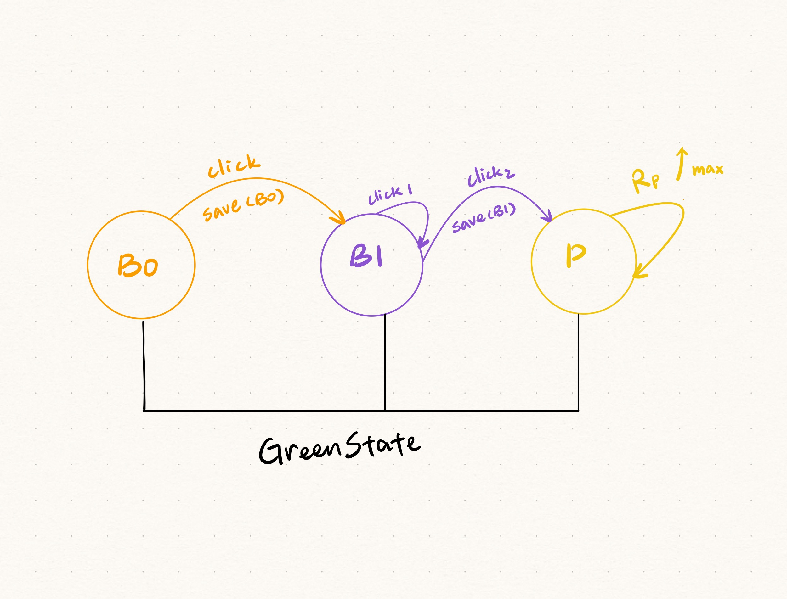
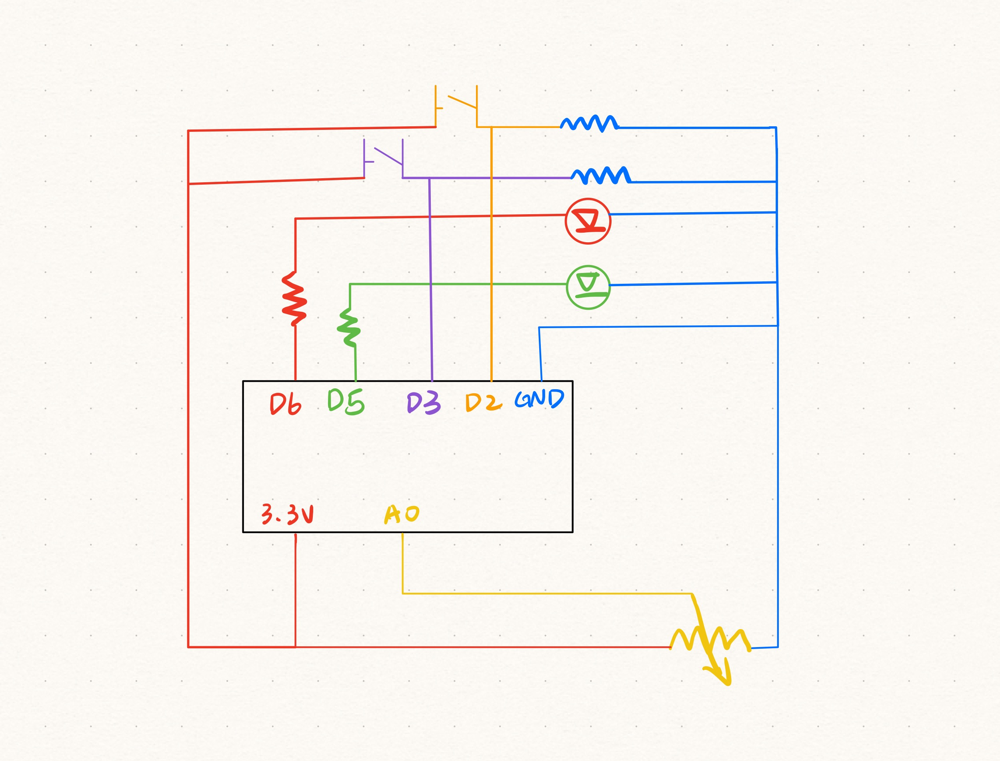

# HW11
 *Drawing of the Finite State Machine.*  

 *Description of the correct steps.*  
1. Press button 0.   
2. Press button 1 twice.  
3. Turn potentiometer all the way to the right.  

 *A schematic drawing of the circuit.*   

